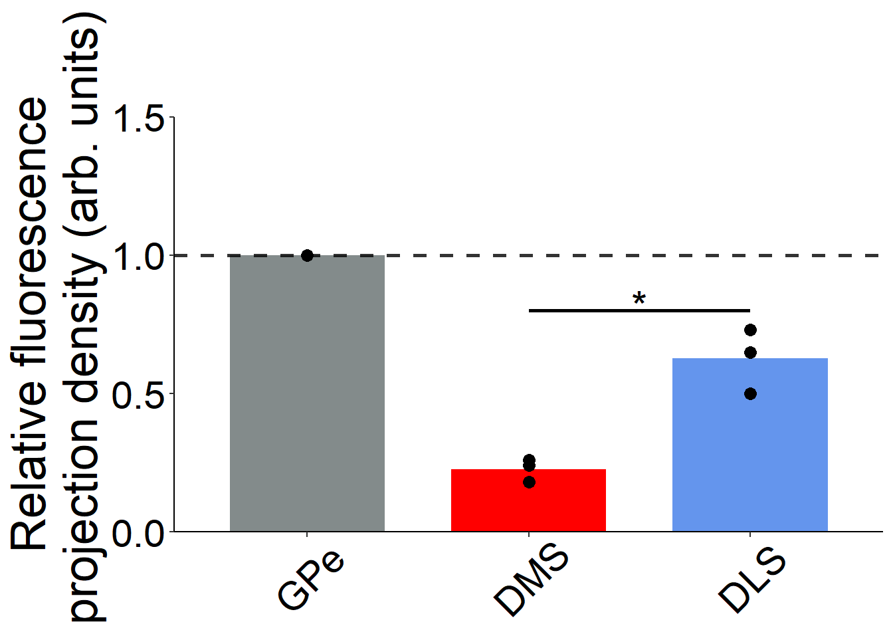
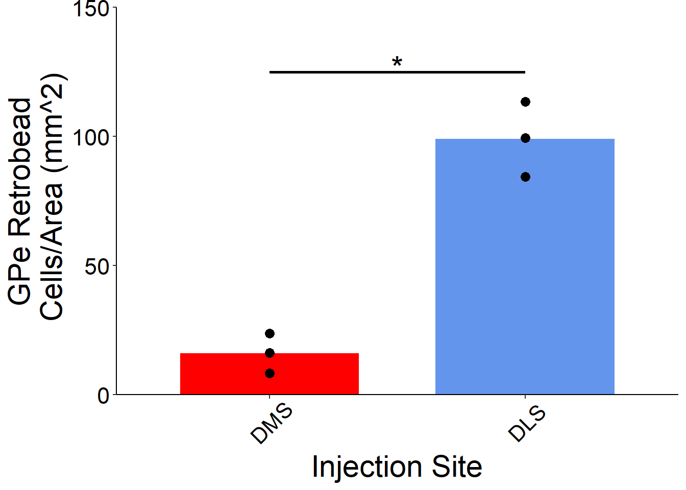
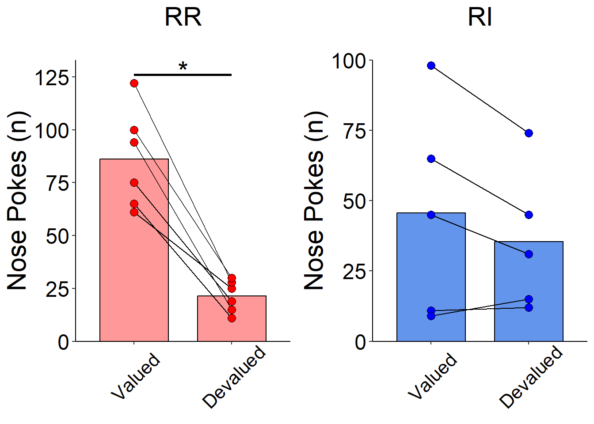

```{r setup, include=FALSE}
knitr::opts_chunk$set(warning= FALSE, message= FALSE, echo = TRUE)
knitr::opts_chunk$set(fig.path = "Figures/", fig.align= "left")
```

### Initialize Libraries:
```{r}
library(tidyverse)
library(dplyr)
library(skimr)
library(infer)
library(forcats)
library(ggpubr)
library(broom)
library(gridExtra)
library(png)
library(rasterImage)
```

## Introduction
##### This paper by Baker et al. seeks to establish a relationship between neuronal projections from the Globus Pallidus external (GPe) to the Dorsal Striatum (dorsolateral specifically), and habitual drug seeking behavior. This analysis was conducted first by establishing which sub-region of the Dorsal Striatum is most dominantly innervated by projections from the GPe. Figure 1 examines the innervation of the Dorsal Striatum (lateral: DSL, medial: DSM) by GPe neurons. From this figure, I recreated Figure 1B and 1D. Figure 1B depicts the relative fluorescence of the DSL vs the DSM in response to an anterograde viral tracer injected into the GPe. Figure 1D depicts effectively the same information confirmed using the opposite direction of tracer (retrograde). THe higher the value of GPE Retrobead Cells/area (mm^2) directly correlates with the number of neurons that peoject between these regions.

### Figure 1 Results:
##### Both anterograde and retrograde tracer injections resulted in the conclusion that arkypallidal neurons from the GPe preferantially innervate the DLS over the DMS. 3 images were used to compute fluorescence values (or Retrobead #) for each analysis, and fluorescence of the GPe was used as the baseline value.
##### Data in Figure 1B was analyzed using a one-way ANOVA with a TukeyHSD posthoc test. Data in Figure 1D were analyzed using a two-tailed t-test. 

##### Figure 2 demonstrates differences in behavioral phenotypes of mice trained on either a Random Ratio (RR) or Random Interval (RI) nose poke paradigm. In this behavioral training, mice are operantly conditioned to poke their nose into a hole with a sensor in order to gain a reward. Trials can be "Valued" or "Devalued". This means that for a correct response, the mouse will be rewarded (Valued) or not rewarded despite nose poking at the appropriate time (Devalued). For RR paradigms, if responses decrease during "Devalued" trials, this is indicative of goal-directed reward-seeking. For RI paradigms, if responses do not decrease during "Devalued" trials, this is indicative of habit-directed reward-seeking. For this figure, I chose to recreate panel B which compares the number of nose pokes between the "Valued" and "Devalued" trials in both the RR and RI behavioral paradigms. This data was compared against activity in GPe -> DLS and GPe -> DMS neurons to correlate neuronal activity with behavioral outcomes, but I did not recreate this aspect of the data for my assignment.

### Figure 2 Results:
##### Mice in the RI paradigm demonstrated a significant reduction in nose poke responses during the "Devalued" trial vs the "Valued" trial, indicating goal-directed reward-seeking behavior. Mice in the RR paradigm demonstrated no significant difference in nose poke responses during the "Devalued" vs "Valued" trials, indicating habit-directed reward-seeking. Data used for these analysis was # of nose pokes per mouse during a single test session (RI: n= 6, RR: n= 5).
##### Data in Figure 2B was analyzed using Wilcoxon Ranked Sum Test. 


## Visualization of Data
### Figure 1 Initial Data Manipulation:
```{r}
# import data for Figure 1 from github repo as 'x'
x <- read_csv("https://raw.githubusercontent.com/LimeTur21/data-analysis-replication/main/Figure1.csv", skip= 1)
# load imported data 'x' as a tibble called 'd'
d <- tibble(x) |>
  transmute(ID...1 = ID...1,
            GPe = GPe,
            DMS...3 = DMS...3,
            DLS...4 = DLS...4,
            ID...6 = ID...6,
            DMS...7 = DMS...7,
            DLS...8 = DLS...8)

# wrangle data from 'd' to include a 'brain_region' variable to correspond to 'rel_fluor' values and winnow data to include only values relevant for Figure 1B. 'rel_fluor' values in this dataframe represent the mean of the relative fluorescence per brain region as compared to the GPe. 
f1B <- tibble(brain_region= c("GPe", "DMS", "DLS"),
              rel_fluor = c(mean(d$GPe), mean(d$DMS...3), mean(d$DLS...4)),
              GPe = d$GPe,
              DMS = d$DMS...3,
              DLS = d$DLS...4)

#  wrangle data from 'd' to include a new 'rel_fluor2' column which contains the mean Retrobead density in the GPe following retrograde tracing from either the DLS or DMS, and to winnow the data to include only values relevant for Figure 1D.
f1D <- tibble(rel_fluor2 = c(mean(d$DMS...7), mean(d$DLS...8), NA),
              DMS_1D = d$DMS...7,
              DLS_1D = d$DLS...8)
```

### Figure 1B Recreation:
```{r}
# change data from 'f1B' to long format, establish the 'name' variable as a factor, and winnow resulting dataframe to include only the 'name' and 'value' column. These columns contain the brain region and raw relative fluorescence values. This dataframe will be used to recreate the scatterplot portion of this sub-figure.
t <- f1B |> pivot_longer(GPe:DLS) |> 
  mutate(name = as.factor(name)) |> 
  dplyr::select(name, value)

# change data from 't' to include only the mean relative fluorescence values and the name of the brain region that those values correspond to. This dataframe will be used to create the bar graph portion of this sub-figure.
t_bar <- t |> group_by(name) |>
  summarise(value= mean(value))

cat("Summaries of Dataframes used for this plot")
head(t)
head(t_bar)

# This is the code that specifies the specifics of the ggplot render. As mentioned above, dataframe 't' is used for the scatterplot points and dataframe t_bar is used for the bar graph portion of this sub-figure recreation.
p1 <- ggplot(t, aes(x= fct_relevel(name, c("GPe", "DMS", "DLS")), y= value)) +
  geom_bar(data = t_bar, stat = "identity", fill=c("cornflowerblue", "red", "azure4"), width= 0.7) +
  geom_point(size= 3) +
  theme(axis.title.x= element_blank()) +
  labs(y= "Relative fluorescence\n projection density (arb. units)", title= "\n\n\n") +
  geom_hline(yintercept= 1.0, linetype= 2, size= 1, alpha= 0.8) +
  annotate("segment", x= 2, xend= 3, y= 0.8, yend= 0.8, size= 1) +
  annotate("text", x= 2.5, y= 0.82, label= "*", size= 8) +
  theme(panel.background= element_rect(fill='transparent'),
         plot.background= element_rect(fill='transparent', color=NA),
         panel.grid.major= element_blank(),
         panel.grid.minor= element_blank()) +
  theme(axis.line= element_line(color= "black"),
        axis.title.y= element_text(size= 27),
        axis.text.y= element_text(size= 22, color= "black"),
        axis.text.x= element_text(size= 22, angle= 45, vjust= 0.6, color= "black")) +
  scale_y_continuous(expand= c(0,0),
                     limits= c(0,1.5))
```
### Publication Figure vs My Recreation (Fig 1B):

#### Publication
{width=40%}


#### Recreation
{width=55%}

### Figure 1D Recreation:
```{r}
# change data from 'f1D' to long format, establish the 'name' variable as a factor, and winnow resulting dataframe to include only the 'name' and 'value' column. These columns contain the brain region and raw Retrobead cells/area (mm^2) values. This dataframe will be used to recreate the scatterplot portion of this sub-figure.
t2 <- f1D |> pivot_longer(DMS_1D:DLS_1D) |> 
  mutate(name = factor(name)) |> 
  dplyr::select(name, value)


# change data from 't2' to include only the mean Retrobead Cells/Area (mm^2) values and the 'name' of the brain region that those values correspond to. This dataframe will be used to create the bar graph portion of this sub-figure.
t_bar2 <- t2 |> group_by(name) |>
  summarise(value= mean(value))

cat("Summaries of Dataframes used for this plot")
head(t2)
head(t_bar2)

# This is the code that specifies the specifics of the ggplot render. As mentioned above, dataframe 't2' is used for the scatterplot points and dataframe t_bar2 is used for the bar graph portion of this sub-figure recreation.
p2 <- ggplot(t2, aes(x= fct_relevel(name, c("DMS_1D", "DLS_1D")), y= value)) +
  geom_bar(data = t_bar2, stat = "identity", fill=c("cornflowerblue", "red"), width= 0.7) +
  geom_point(size= 3) +
  labs(y="GPe Retrobead\n Cells/Area (mm^2)", x= "Injection Site") +
  annotate("segment", x= 1, xend= 2, y= 125, yend= 125, size= 1) +
  annotate("text", x= 1.5, y= 127, label= "*", size= 8) +
  scale_x_discrete(labels= c("DMS_1D" = "DMS", "DLS_1D" = "DLS")) +
  scale_y_continuous(expand = c(0,0),
                     limits = c(0,150)) +
  theme(panel.background = element_rect(fill='transparent'),
         plot.background = element_rect(fill='transparent', color=NA),
         panel.grid.major = element_blank(),
         panel.grid.minor = element_blank()) +
  theme(axis.line = element_line(color = "black"),
        axis.title.y= element_text(size= 22),
        axis.text.y= element_text(size= 17, color= "black"),
        axis.title.x= element_text(size= 22),
        axis.text.x= element_text(size= 16, angle= 45, vjust= 0.6, color= "black")) +
  theme(plot.title= element_text(size= 24, vjust= 2.1))
```
### Publication Figure vs My Recreation (Fig 1D):

#### Publication

{width=36%}

#### Recreation
{height=385px}

```{r}
# import data for Figure 2 from github repo as 'x2'
x2 <- read_csv("https://raw.githubusercontent.com/LimeTur21/data-analysis-replication/main/Figure2.csv", col_names= TRUE, skip= 2)
# load imported data 'x2' as a tibble called 'd2'
d2 <- tibble(x2)

# winnow data from 'd2' to include only values relevant for Figure 2B. This dataframe includes nose poke data from each mouse based on the trial and what response paradigm (RR vs RI) the mouse went through. Data were renamed for convenience in subsequent code.
f2B <- tibble(RR20_Valued = d2$Valued...2,
              RR20_Devalued = d2$Devalued...3,
              RI120_Valued = d2$Valued...4,
              RI120_Devalued = d2$Devalued...5)

# change data from 'f2B' to long format, establish the 'name' variable as a factor, and winnow resulting dataframe to include only the 'name' and 'value' column. Furthermore, I excluded NA values to remove the single NA row in the RR20 column because this sub-figure panel had only 5 mice used in the analysis vs the RI group which had 6 mice. These columns contain the number of nose pokes per mouse for each trial (Valued vs Devalued). This dataframe will be used to recreate the scatterplot portion of this sub-figure.
t2B_RR20 <- f2B |> pivot_longer(RR20_Valued:RR20_Devalued) |>
  mutate(name = factor(name)) |>
  dplyr::select(c(name, value)) |>
  na.exclude()

# change data from 't2B_RR20' to include only the mean nose poke values and the 'name' of the trial (Valued vs Devalued) that those values correspond to. This dataframe will be used to create the bar graph portion of this sub-figure.
t_bar2B_RR20 <- t2B_RR20 |> group_by(name) |>
  summarise(value= mean(value))

cat("Summaries of Dataframes used for this plot")
head(t2B_RR20)
head(t_bar2B_RR20)

# this was included because I thought I could replicate the repeated measures lines to indicate which atapoints corresponded between the 'Valued' and 'Devalued' trials, but it didn't work out and I ended up doing each line manually. I thought I'd inlude it to show you my thought process in constructing this recreation. 
t_line2B_RR20 <- f2B |>
  dplyr::select(RR20_Valued, RR20_Devalued) |>
  na.exclude() |>
  mutate(id = c(1,2,3,4,5,6))

# create variables that encompass only the 'Valued' or 'Devalued' nose poke data from the RR behavioral paradigm. I did this to make it easier to create the individual repeated measures lines that I tried to make with the t_line2B_RR20 dataframe. This worked way better so I kept with this format.
valued_only <- t2B_RR20 |>
  filter(name == "RR20_Valued")
devalued_only <- t2B_RR20 |>
  filter(name == "RR20_Devalued")

# This is the code that specifies the specifics of the ggplot render for the Figure 2B sub-panel 1. As mentioned above, dataframe 't2B_RR20' is used for the scatterplot points and dataframe t_bar2B_RR20 is used for the bar graph portion of this sub-figure, sub-panel recreation. This portion of the sub-figure is specific to the RR behavioral paradigm.
p2B.1 <- ggplot(t2B_RR20, aes(x= fct_relevel(name, c("RR20_Valued", "RR20_Devalued")), y= value)) +
  geom_bar(data = t_bar2B_RR20, stat = "identity", color= "black", fill= "red", alpha= 0.4, width= 0.7) +
  annotate("segment", x= 1, xend= 2, y= valued_only[["value"]][[1]], yend= devalued_only[["value"]][[1]]) +
  annotate("segment", x= 1, xend= 2, y= valued_only[["value"]][[2]], yend= devalued_only[["value"]][[2]]) +
  annotate("segment", x= 1, xend= 2, y= valued_only[["value"]][[3]], yend= devalued_only[["value"]][[3]]) +
  annotate("segment", x= 1, xend= 2, y= valued_only[["value"]][[4]], yend= devalued_only[["value"]][[4]]) +
  annotate("segment", x= 1, xend= 2, y= valued_only[["value"]][[5]], yend= devalued_only[["value"]][[5]]) +
  annotate("segment", x= 1, xend= 2, y= valued_only[["value"]][[6]], yend= devalued_only[["value"]][[6]]) +
  geom_point(fill= "red", size= 3, color= "black", pch= 21) +
  annotate("segment", x= 1, xend= 2, y= 126, yend= 126, size= 1) +
  annotate("text", label= "*", x= 1.5, y= 128, size= 8) +
  labs(y= "Nose Pokes (n)",
       title= "RR") +
  theme(axis.title.x= element_blank(),
        plot.title = element_text(hjust=0.5)) +
  theme(legend.position= "none") +
  scale_y_continuous(expand = c(0, 0),
                     limits = c(0, 133)) +
  scale_x_discrete(labels= c("RR20_Valued"= "Valued", "RR20_Devalued"= "Devalued")) +
  theme(panel.background = element_rect(fill='transparent'),
         plot.background = element_rect(fill='transparent', color=NA),
         panel.grid.major = element_blank(),
         panel.grid.minor = element_blank()) +
  theme(axis.line = element_line(color = "black")) +
  theme(plot.title = element_text(margin=margin(b = 25, unit = "pt"), size= 22),
        axis.title.y= element_text(size= 22),
        axis.text.y= element_text(size= 18, color= "black"),
        axis.text.x= element_text(size= 16, angle= 45, vjust= 0.6, color= "black"))

##########

# change data from 'f2B' to long format, establish the 'name' variable as a factor, and winnow resulting dataframe to include only the 'name' and 'value' column. I left the na.exclude() line in there as an artifcat of copy-paste from the previous sub-figure sub-panel. These columns contain the number of nose pokes per mouse for each trial (Valued vs Devalued). This dataframe will be used to recreate the scatterplot portion of this sub-figure.
t2B_RI120 <- f2B |> pivot_longer(RI120_Valued:RI120_Devalued) |>
  mutate(name = factor(name)) |>
  dplyr::select(c(name, value)) |>
  na.exclude()

# change data from 't2B_RI120' to include only the mean nose poke values and the 'name' of the trial (Valued vs Devalued) that those values correspond to. This dataframe will be used to create the bar graph portion of this sub-figure.
t_bar2B_RI120 <- t2B_RI120 |> group_by(name) |>
  summarise(value= mean(value))

cat("Summaries of Dataframes used for this plot")
head(t2B_RI120)
head(t_bar2B_RI120)

# create variables that encompass only the 'Valued' or 'Devalued' nose poke data from the RI behavioral paradigm. I did this to make it easier to create the individual repeated measures lines. I did not try to make a "line" version of this dataframe because I saw it didn't work previously so I kept with the manual addition of lines through the annotate() function.
valued_only <- t2B_RI120 |>
  filter(name == "RI120_Valued")
devalued_only <- t2B_RI120 |>
  filter(name == "RI120_Devalued")

# This is the code that specifies the specifics of the ggplot render for the Figure 2B sub-panel 2. As mentioned above, dataframe 't2B_RI120' is used for the scatterplot points and dataframe t_bar2B_RI120 is used for the bar graph portion of this sub-figure, sub-panel recreation. This portion of the sub-figure is specific to the RI behavioral paradigm.
p2B.2 <- ggplot(t2B_RI120, aes(x= fct_relevel(name, c("RI120_Valued", "RI120_Devalued")), y= value)) +
  geom_bar(data = t_bar2B_RI120, stat = "identity", color= "black", fill= "cornflowerblue", width= 0.7) +
  annotate("segment", x= 1, xend= 2, y= valued_only[["value"]][[1]], yend= devalued_only[["value"]][[1]]) +
  annotate("segment", x= 1, xend= 2, y= valued_only[["value"]][[2]], yend= devalued_only[["value"]][[2]]) +
  annotate("segment", x= 1, xend= 2, y= valued_only[["value"]][[3]], yend= devalued_only[["value"]][[3]]) +
  annotate("segment", x= 1, xend= 2, y= valued_only[["value"]][[4]], yend= devalued_only[["value"]][[4]]) +
  annotate("segment", x= 1, xend= 2, y= valued_only[["value"]][[5]], yend= devalued_only[["value"]][[5]]) +
  geom_point(fill= "blue", size= 3, color= "black", pch= 21) +
  labs(y= "Nose Pokes (n)",
       title= "RI") +
  theme(axis.title.x= element_blank(),
        plot.title = element_text(hjust=0.5)) +
  theme(legend.position= "none") +
  scale_y_continuous(expand = c(0, 0),
                     limits = c(0, 100)) +
  scale_x_discrete(labels= c("RI120_Valued"= "Valued", "RI120_Devalued"= "Devalued")) +
  theme(panel.background = element_rect(fill='transparent'),
         plot.background = element_rect(fill='transparent', color=NA),
         panel.grid.major = element_blank(),
         panel.grid.minor = element_blank()) +
  theme(axis.line = element_line(color = "black")) +
  theme(plot.title = element_text(margin=margin(b = 25, unit = "pt"), size= 22),
        axis.title.y= element_text(size= 22),
        axis.text.y= element_text(size= 18, color= "black"),
        axis.text.x= element_text(size= 16, angle= 45, vjust= 0.6, color= "black"))

##########

# This code is commented out for html rendering, but it was originally used to create the two-panel image seen in my creation
#grid.arrange(p2B.1, p2B.2, nrow = 1)
```
### Publication Figure vs My Recreation (Fig 2B):

#### Publication
{width=400px}

#### Recreation
{width=425px}

## Statistical Replication/Reanalysis
#### Replication of Fig 1B One-Way ANOVA:
##### I performed a One-Way ANOVA as described in the paper, though the direction of the alternative hypothesis was not defined by the authors. Thus, I chose the "greater" option, but the interpretation of the ANOVA remains the same. In my replication I was able to achieve the same values reported by the authors for both the ANOVA and the posthoc TukeyHSD.
```{r}
# One-Way ANOVA to see if brain region (DMS vs DLS) is predictive of relative fluorescence value.
aov1B <- aov(value ~ name, data= t, alternative= "two.sided")
summary(aov1B)
cat("\nPublication F-Value: 87.6\n", "Publication ANOVA p-value: p < 0.0001\n\n", "My F-Value: 87.6\n", "My p-value: 3.63e-05\n\n", sep= "")

# releveling dataframe 't' to have GPe as the reference level since the value in DMS and DLS are relative to the GPe values (which are all 1 anyway)
t <- within(t, name <- relevel(name, ref = "GPe"))

# Post-Hoc replication of the Tukey HSD performed in the study.
posthoc_aov1B <- TukeyHSD(aov1B, which= "name", conf.level= 0.95)
posthoc_aov1B

cat("Publication p-value: p < 0.0012\n", "My p-value: 0.0011652", sep= "")

# Printing out the R-squared value from the glance() function since this is not included in the summary of my anova object.
cat("R-squared: ", glance(aov1B)["r.squared"][[1]], sep= "")
```

#### Replication of Fig 1D Two-Sided t-Test:
##### I performed a two-sided t-test to compare the Retrobead Cells/Area (mm^2) between the DMS and DLS. Fortunately, I was able to replicate the results reported by the authors in this comparison. 
```{r}
# t-test to determine difference in Retrobead Cells/Area (mm^2) between the DLS and the DMS
ttest1D <- t.test(f1D$DMS_1D, f1D$DLS_1D, alternative= "two.sided")

cat("My p-value: 0.003099762\n")
glance(ttest1D)
cat("Publication p-value:", "p < 0.05")
```

#### Replication of Fig 2B Wilcoxon Rank Sum Test:
##### I performed two Wilcoxon Rank Sum Tests to compare the nose pokes between the 'Valued' and 'Devalued' trials in both the RR and RI behavioral paradigms. Fortunately, I was able to replicate the outcome of the results reported by the authors in this comparison,  but my values were not exactly the same. Upon discussing this analysis further, it appears that this analysis is not appropriate for the RI behavioral paradigm data. This is because there are duplicate values in the 'Valued' and 'Devalued' columns, and "ties" are not properly addressed with this test.
```{r}
# Wilcoxon rank sum tests used to evaluate differences between nose pokes in 'Valued' and 'Devalued' trials in both the RR and RI behavioral paradigms.
f2B_wilcox1 <- wilcox.test(f2B$RR20_Valued, f2B$RR20_Devalued, alternative= "two.sided")
f2B_wilcox2 <- wilcox.test(f2B$RI120_Valued, f2B$RI120_Devalued, alternative= "two.sided")

# formatted output of the Wilcoxon test for both the RR and RI behavioral paradigms.
cat("Wilcox Test (RR)\nW:", 
    f2B_wilcox1["statistic"][[1]], 
    "\np-value:", f2B_wilcox1["p.value"][[1]],
    "\nAlternative Hypothesis:", f2B_wilcox1["alternative"][[1]],
    "\n\nWilcox Test (RI)\nW:", 
    f2B_wilcox2["statistic"][[1]], 
    "\np-value:", f2B_wilcox2["p.value"][[1]],
    "\nAlternative Hypothesis:", f2B_wilcox2["alternative"][[1]])
cat("Publication Values:\n", "p-value (RR): 0.03\n", "p-value (RI): 0.62")
```

## Summary/Discussion
#### Overall, I feel that I did a good job of replicating the figures and statistics given the information provided by the authors. There were a few notable difficulties with replicating this data, however I was generally satisfied with the reporting in this publication.

Initially, I began with recreating the figures that I thought would provide the most relevant information in a "summary version" of this paper. My R-ability was also considered in choosing the figures I wanted to replicate. Firstly, I appreciated that the Figure 1 graphics provided information that supported the hypothesis of the paper in a broader scope. I did have some issue when it came to Figure 1D. The figure legend incorrectly identifies what portion of the figure represents the Two-Sided t-Test (sub-fig C instead of the correct sub-fig: D). Despite this drawback, I was able to interpret what they intended to publish and my subsequent analysis did replicate the reported results.

Figure 2 was a more complicated figure replication, but the statistical analysis was very straight forward, and I was able to replicate the outcome of the authors results. Unfortunately, I was not able to replicate the exact values, but the interpretation fo my analysis is the same as the publication authors. Funny enough, this turned out to be a point of contention as the statistical test that was easy to replicate turned out to not to be the most appropriate for the underlying data. As mentioned in the Data Visualization Replication section, there were duplicate values in the comparison groups of my Wilcoxon Rank Sum tests. One potential workaround would be to use a non-parametric analysis (such as permutation testing that we learned in class) to break the association between nose poke and trial value (i.e. whether the mouse was rewarded for a correct nose poke or not). Despite this information, I was able to recreate their analysis so I will consider this a success.

All of the figures that I chose to replicate displayed descriptive statistics of the data. For instance, each of the bar graphs that I plotted represent the mean value of the relevant data. I did not plot the error bars that can be seen on Figure 1B and 1D as I ran out of time and I couldn't figure out an eloquent programmatic way of adding this to the plot. My plan was to use the mean value of the relevant data, and then calculate standard error by using the sd() function to calculate standard deviations of the samples. Then I would devide the calculated sd() values by the square root of the sample size for each sub-figure. I intended to incorporate lines to represent confidence intervals using the annotate() fucntion that I used for many of the other lines on my figures.


## References
##### Baker, M., Kang, S., Hong, S.-I., Song, M., Yang, M. A., Peyton, L., Essa, H., Lee, S. W., & Choi, D.-S. (2023). External globus pallidus input to the dorsal striatum regulates habitual seeking behavior in male mice. Nature Communications, 14(1), Article 1. https://doi.org/10.1038/s41467-023-39545-8

